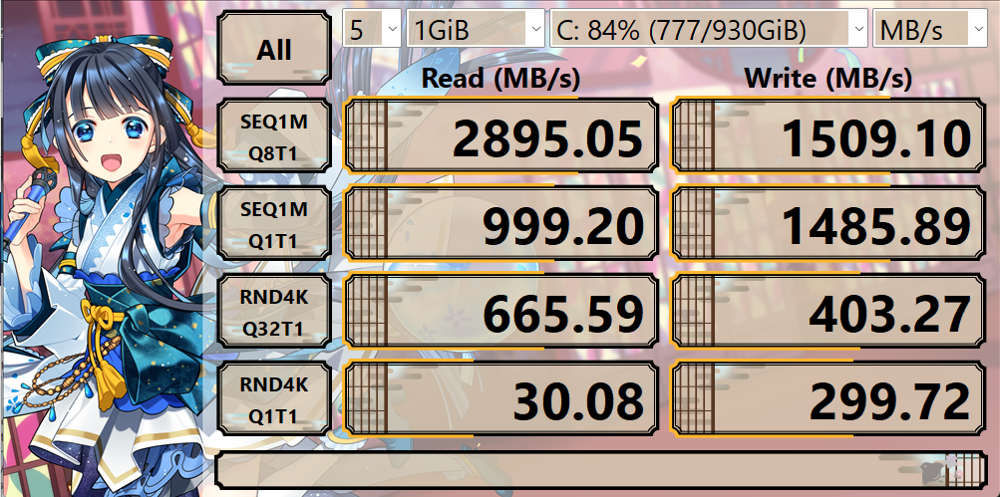

on peut voir qu'entre la vitesse expecté et la vitesse réel il y a un gap qui s'explique par une mise à jour à faire du pilotes et du micrologiciel ou des vérifications de paramètre au niveau du bios ou un ssd avec un mauvaise état de santé ou un problème lié à la température du ssd.